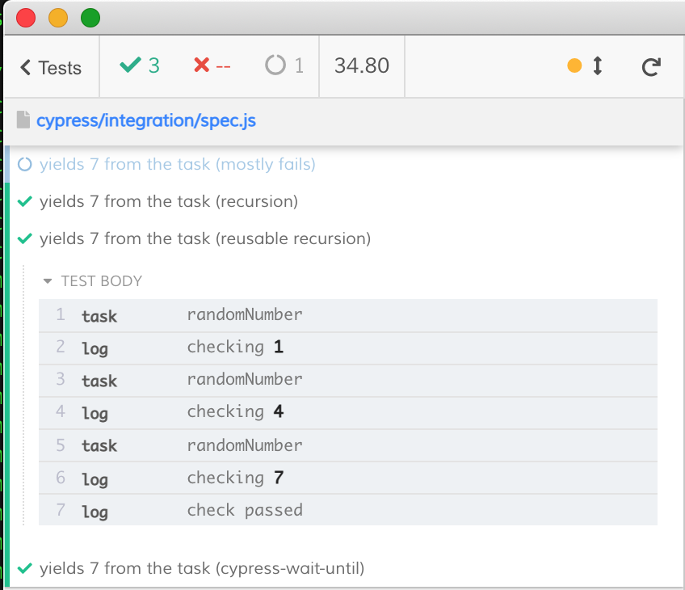

# avoid-while-loops-in-cypress
> A small example showing how to use recursion to avoid JavaScript loops in Cypress

In the [plugins file](./cypress/plugins/index.js) we have a task that returns a random digit after 1 second delay. We want to call `cy.task` until it returns 7. See several solutions in the [cypress/integration/spec.js](./cypress/integration/spec.js) file.

## See also

- The recipe ["Page reloads"](https://github.com/cypress-io/cypress-example-recipes#testing-the-dom) reloads the page until it shows the number 7
